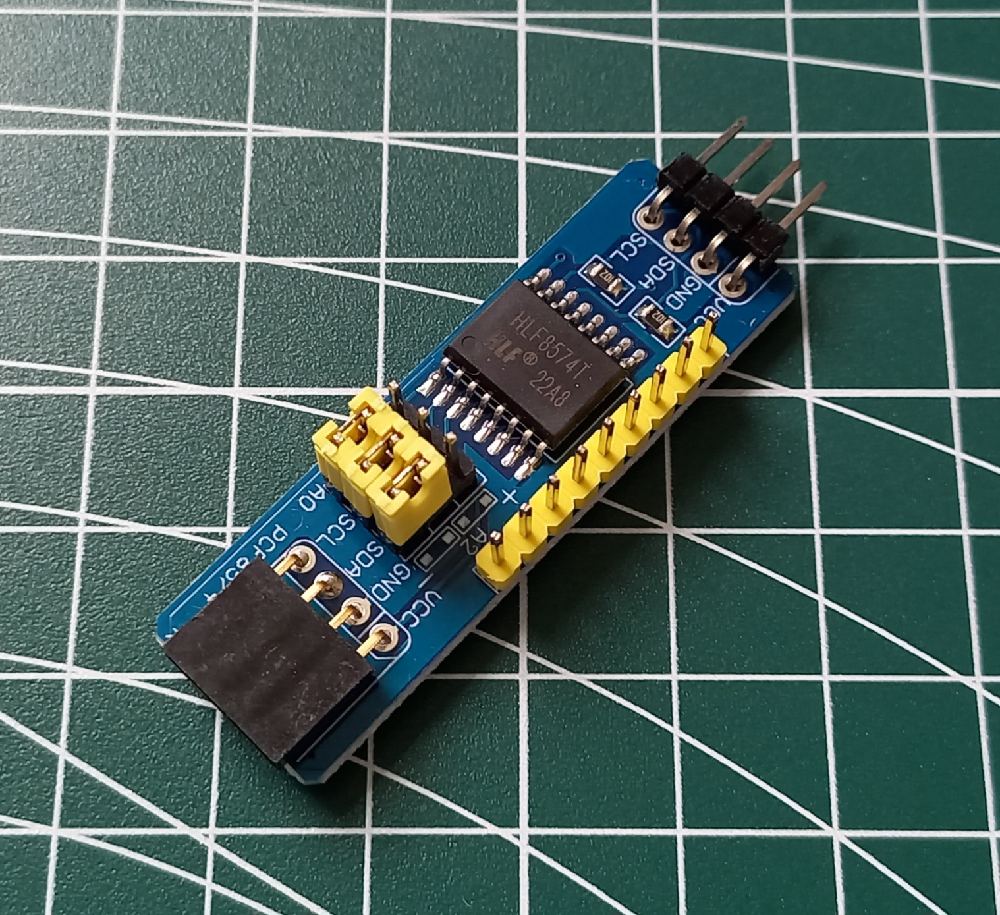
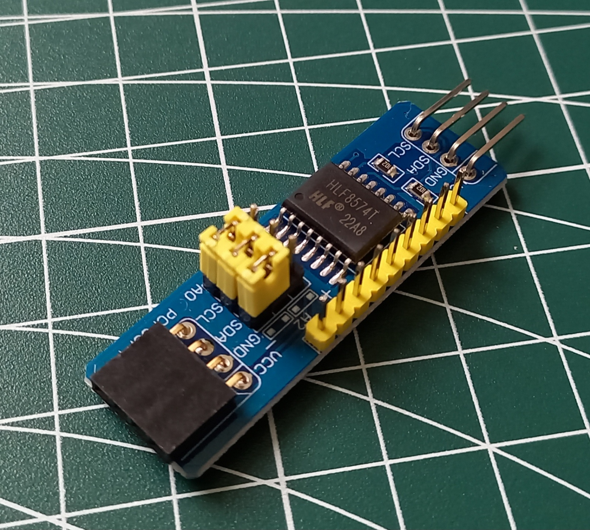
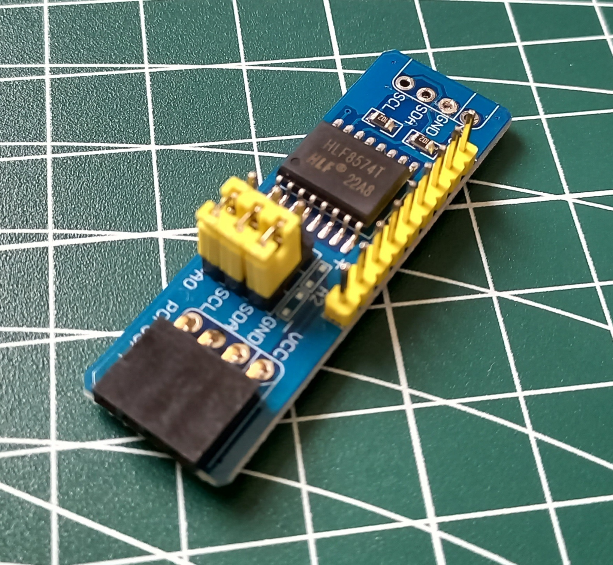
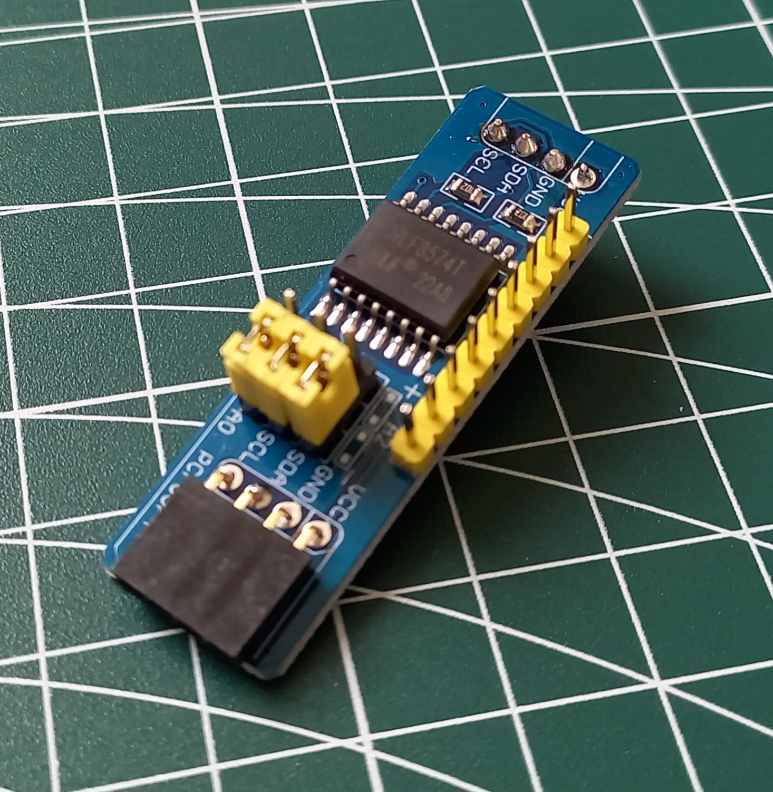
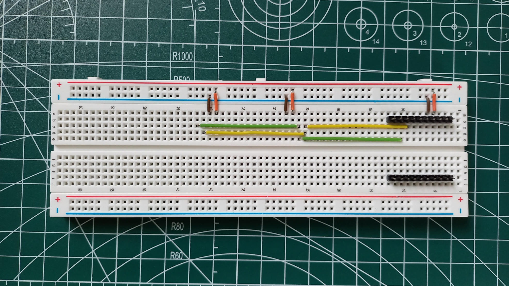
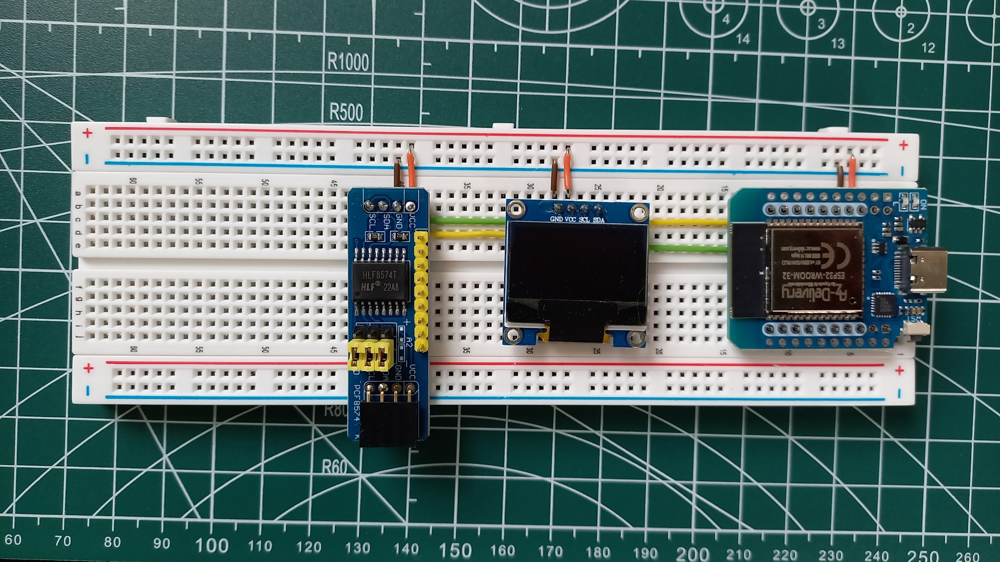

= Bluetooth-Retro-Controller

== Bill of Materials

* https://www.az-delivery.de/products/esp32-d1-mini[ESP32 D1 Mini]

Windows Drivers for USB-to-Serial needed to program D1 Mini: https://www.silabs.com/developer-tools/usb-to-uart-bridge-vcp-drivers?tab=downloads

Working settings: 

image::images/settings-d1-mini.png[]

I2C IO Expander modification

Bread-Board:

JAMMA Belegungsplan:

image::https://ledtreppe.de/wp-content/uploads/2020/06/vh-data_produktbild_60in1_jamam_belegungsplan.jpg[]

https://cdn.shopify.com/s/files/1/0008/4262/9179/files/60-in-1-iCade.pdf?3063006056021487000[iCade 60 in 1 Manual]