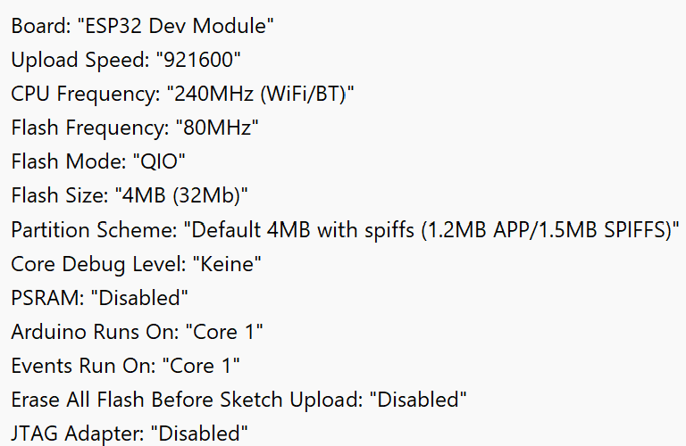

# Bluetooth-Retro-Controller

Windows Drivers for USB-to-Serial needed to program D1 Mini: https://www.silabs.com/developer-tools/usb-to-uart-bridge-vcp-drivers?tab=downloads

Working settings: 

I2C IO Expander modification

image::images/20250615_124618.jpg[]

image::images/20250615_124722.jpg[]

image::images/20250615_131339.jpg[]

Bread-Board:

image::images/20250615_165404.jpg[]

image::images/20250615_165428.jpg[]

